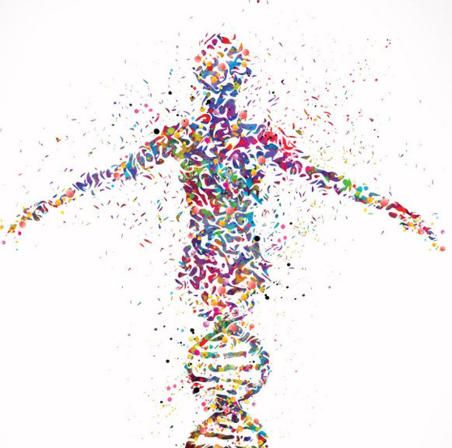

  <a title="Image source, no affiliation" href="https://www.etsy.com/listing/567608817/dna-human-watercolor-print-dna-art">
  

# BI: 428: Human Genetics · Portland State University · Winter 2021

 

    
    
    

## **Course Materials**

- **Required Text**: [Korf & Irons &mdash; Human Genetics and Genomics (4th ed)](https://1lib.us/book/2655250/afad73)
- Supplementary text: [Strachan &mdash; Human Molecular Genetics (5th ed)](https://1lib.us/book/5278782/fea561)

    ### Recommended Readings
    - [The Coming Plague: Newly Emerging Diseases in a World Out of Balance](https://1lib.us/book/3501748/56b790)
    - [Genome: The Autobiography of a Species in 23 Chapters](https://1lib.us/book/5281757/8db11f)
    - [Deadly Feasts](https://1lib.us/book/4793719/852983)
 
##  **Weekly Schedule**

The following schedule is tentative and may be changed. Originally made from the syllabus. All changes will be noted here.

### **Week 1** (Jan 4-6) **Pedigree Analysis, Mendelian Disorders**

| | Krof & Irons | D2L | Assignment | Special Assignment | 
|-|:---:|:---:|:---:|:---:|
| | 1,2,*3* | *TBA* | Pedigree | [OMIM](https://omim.org/) |
|Due| --- | --- | Wed 6:40 pm | Fri 6:00 pm |

 

### **Week 2** (Jan 11-13) **Chromosome Structure and Nomenclature, Syndromes**

| | Krof & Irons | D2L | Assignment | 
|-|:---:|:---:|:---:|
| | 6,9 | *TBA* | Journal Article |
|Due| --- | --- | Wed, 6:40 pm | 

 

### **Week 3** (Jan 18-20) **Sex determination**

| | Krof & Irons | D2L | Assignment |
|-|:---:|:---:|:---:|
| | --- | *TBA* | Journal Article |
|Due| --- | --- | Wed, 6:40 pm |

 

### **Week 4** (Jan 25-27) **Development and Epigenetics/Imprinting**

| | Krof & Irons | D2L | Assignment |
|-|:---:|:---:|:---:|
| | 6,12| *TBA* | Journal Article |
|Due| --- | --- | Wed, 6:40 pm |

 

### **Week 5** (Feb 1-3) **Midterm and Metabolic Pathways/Inborn Errors of Metabolism**

| | Krof & Irons | D2L | Midterm | 
|-|:---:|:---:|:---:|
| | 11 | *TBA* | Midterm |
|Due| --- | --- | Wed, 6:00 pm |

 

### **Week 6** (Feb 8-10) **Metabolic Pathways/Inborn Errors of Metabolism (cont.)**

| | Krof & Irons | D2L | Assignment |
|-|:---:|:---:|:---:|
| | 10,11,13,14 | *TBA* | Journal Article |
|Due| --- | --- | Wed, 6:40 pm |

 

### **Week 7** (Feb 15-17) **Mapping &amp; Linkage Analysis, Mapping Complex Disease**

| | Krof & Irons | D2L | Assignment |
|-|:---:|:---:|:---:|
| | 4,5 | *TBA* | Journal Article |
|Due| --- | --- | Wed, 6:40 pm |

 

### **Week 8** (Feb 22-24) **The Human Genome and Genome-Wide Association Studies**

| | Krof & Irons | D2L | Assignment |
|-|:---:|:---:|:---:|
| | 4,14 | *TBA* | Journal Article |
|Due| --- | --- | Wed, 6:40 pm |

 

### **Week 9** (Mar 1-3) **Bioethics**

| | Krof & Irons | D2L | Assignment |
|-|:---:|:---:|:---:|
| | 10,13 | *TBA* | Bioethics Panel |
|Due| --- | --- | --- |

 

### **Week 10** (Mar 8-10) **Cancer Genetics**

| | Krof & Irons | D2L | Assignment |
|-|:---:|:---:|:---:|
| | 15,16,17 | *TBA* | What is CRISPR |
|Due| --- | --- | Wed, 6:40 pm |

 

### **Final Exam**
- 9:00 am Monday (3/15) 
- Due: Wednesday (3/17) by 6:00 pm

 

## **Journal Article Summaries**

### Useful Resources
- Check out [ResearchHub](https://www.researchhub.com/referral/e83718f2-d378-474c-be30-a0e701b775f9)&mdash;an absolutely fantastic site aimed at accelerating the pace of scientific research by making science accessible to everyone, encouraging more collaborative environments, and bringing papers that matter to you to your attention. I am willing to bet that the way we do science will change dramatically when this site see's more mainstream adoption.
- Tired of terrible UI and trouble accessing all the journals? Use [Sci-Hub](https://sci-hub.se/). I'm not sure if it's exactly legal, but we pay for the journals through our tuition, so it's more of just a better way of accessing them. Just search with the DOI and you'll probably find the paper your looking for&mdash;I have yet to come across that isn't available (preprint or published).

### My Journal Summaries

| Week 2 | Week 3 | Week 4 | Week 6 | Week 7 | Week 8 | Week 9 |
|:------:|:------:|:------:|:------:|:------:|:------:|:------:|
|Not Determined|Not Determined|Not Determined|Not Determined|Not Determined|Not Determined|Not Determined|
|view pdf|view pdf|view pdf|view pdf|view pdf|view pdf|view pdf|

 

- Template for journal article (needs to be made)
- Getting started with latex (need to make video guide)