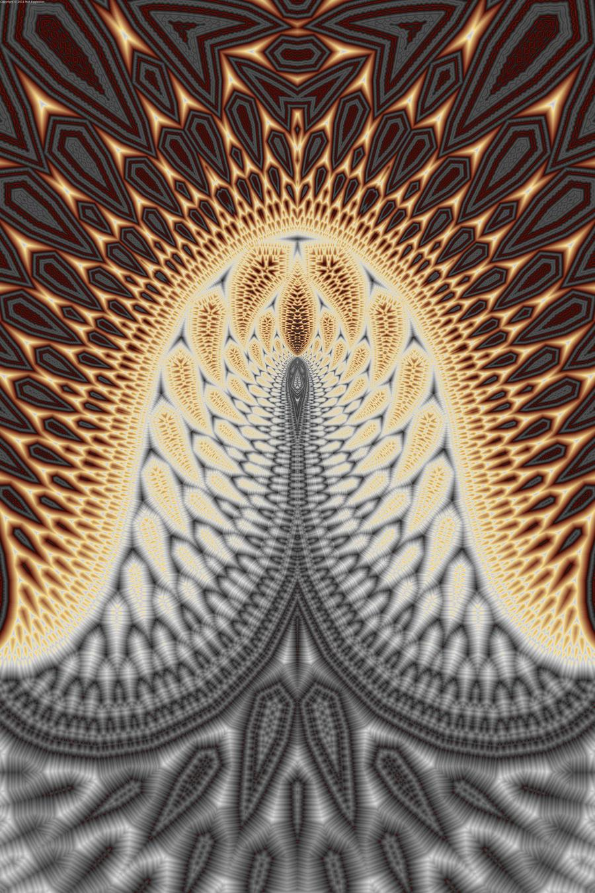

  <kbd>
    
  </kbd>

# Statistics

- Future classes and other content related to statistics will be integrated into this course, however, I predict no new updates for at least ~6 months.

## Resources

- [**Statistics** for Machine Learning w/ code by **Mike X Cohen**](https://www.udemy.com/course/statsml_x/) &rarr; completed 🏆
  - [📑 Relevant notes](http://raw.githubusercontent.com/nosvagor/notes/master/assets/prior/statistics.pdf) &rarr; v1, done 🏫

## Exercises

- [Udemy](/python/statistics/udemy) &rarr; completed 🏆
